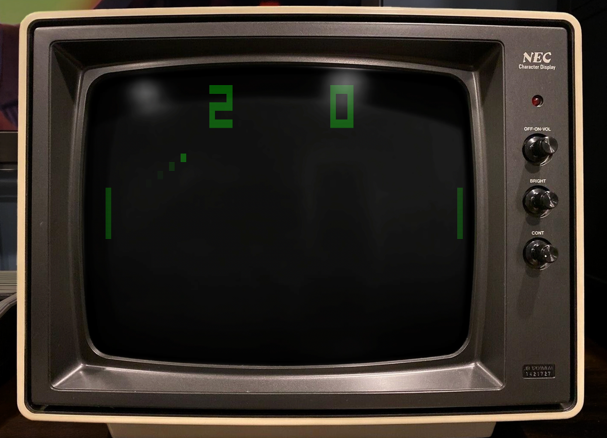
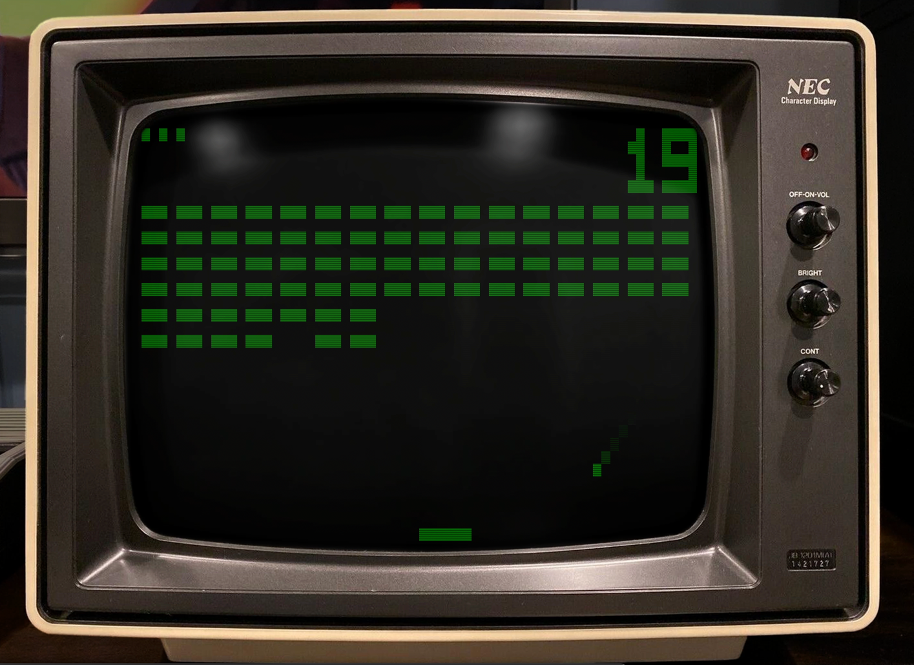

= Chip-8 emulator

This is an implementation of a Chip-8 "emulator".
(It's not really an emulator but rather a processor like interpreter for a limited set of machine code instructions.)

Nothing remarkable but a fun amusement during a weekend.

Although the Chip-8 "machine" or processor is very limited it can produce a lot of fun, 70's like, applications and games.

For more information see:

- https://en.wikipedia.org/wiki/CHIP-8
- https://tobiasvl.github.io/blog/write-a-chip-8-emulator/

== Examples

Here are some examples of running games...

(It's not exciting game play but a rather short clip to show off the fantastic graphic abilities of a CHIP-8 virtual machine.)

=== Pong

https://vimeo.com/765107952[Pong video on Vimeo]

=== Brix

https://vimeo.com/765107974[Brix video on Vimeo]

== Disassembler

I made a disassembler to be able to find out what other programs were doing, just parsing the instructions of the ROM-files and printing actions in a more natural language.

(Well, the "ROM" is not really read-only as the program can self rewrite/mutate in memory during execution).

.IBM Logo disassembly (link:documentation/disassembly_IBM_Logo.txt[full disassembly])
[source,text]
----
Disassembly of "roms/IBM Logo.ch8":
0x200:  0x00  ░░░░░░░░    00E0    00E0: Clear screen
0x201:  0xE0  ███░░░░░
0x202:  0xA2  █░█░░░█░    A22A    ANNN: Set register I to point at address 0x22A
0x203:  0x2A  ░░█░█░█░
0x204:  0x60  ░██░░░░░    600C    6XNN: Set register V0 to value 0x0C
0x205:  0x0C  ░░░░██░░
0x206:  0x61  ░██░░░░█    6108    6XNN: Set register V1 to value 0x08
0x207:  0x08  ░░░░█░░░
0x208:  0xD0  ██░█░░░░    D01F    DXYN: Xor draw sprite of pixel size 8xF, from address pointed to by register I, at screen position (V0, V1)
0x209:  0x1F  ░░░█████
0x20A:  0x70  ░███░░░░    7009    7XNN: Add value 0x09 to register V0
0x20B:  0x09  ░░░░█░░█
0x20C:  0xA2  █░█░░░█░    A239    ANNN: Set register I to point at address 0x239
0x20D:  0x39  ░░███░░█
[...]
----